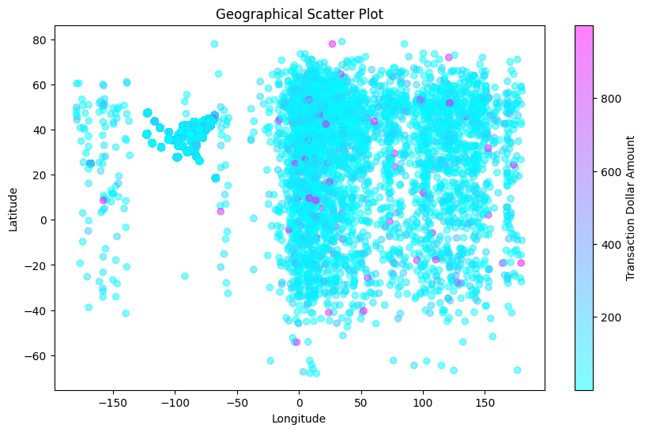
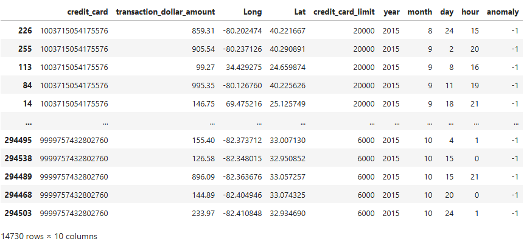
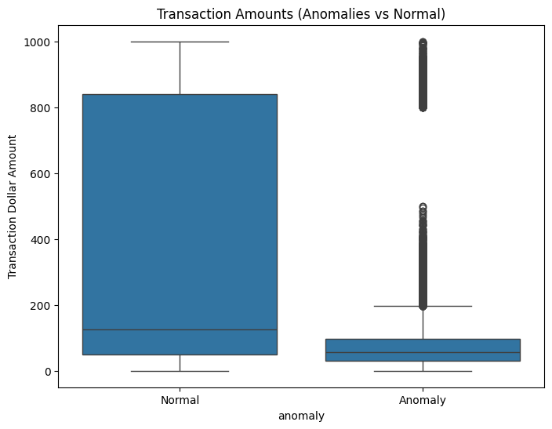
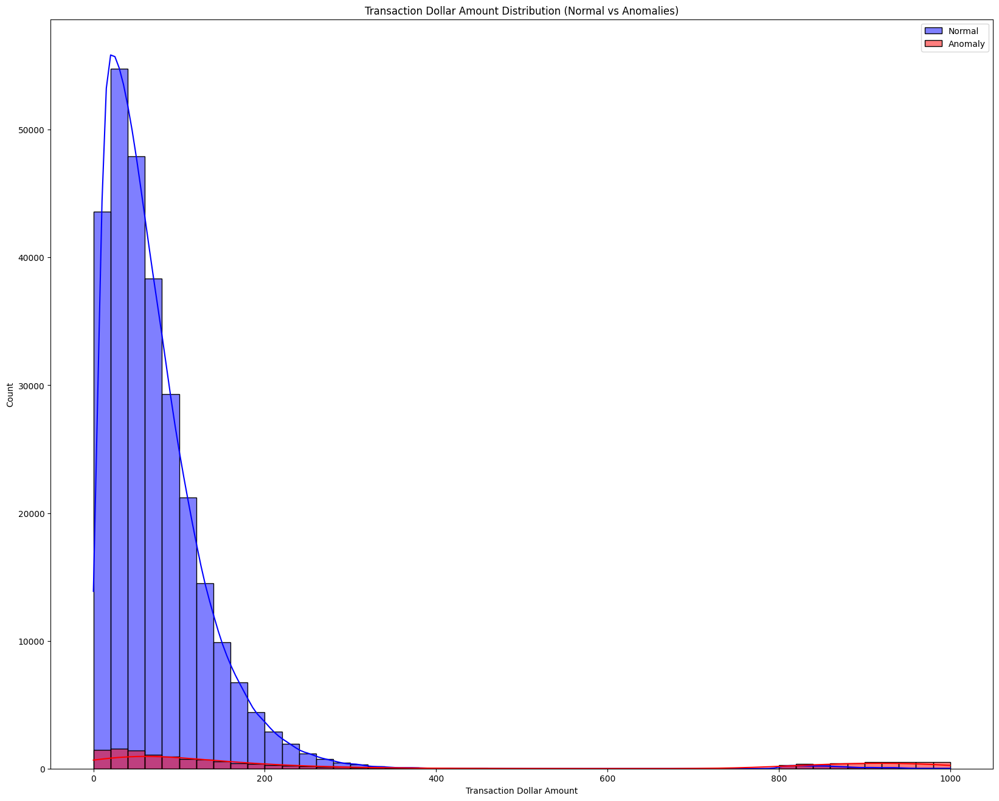
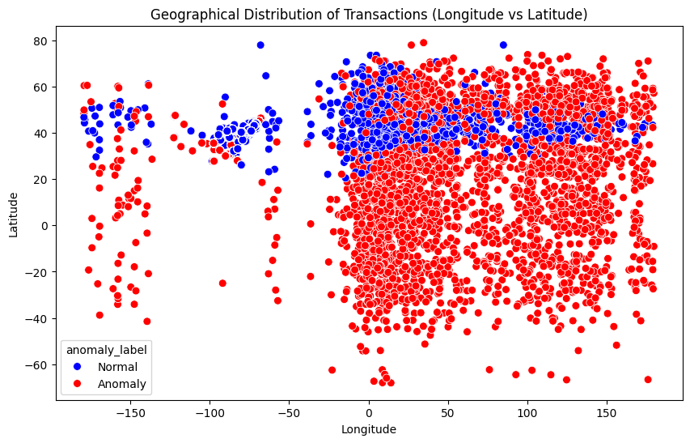
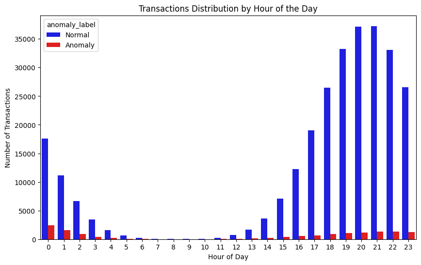
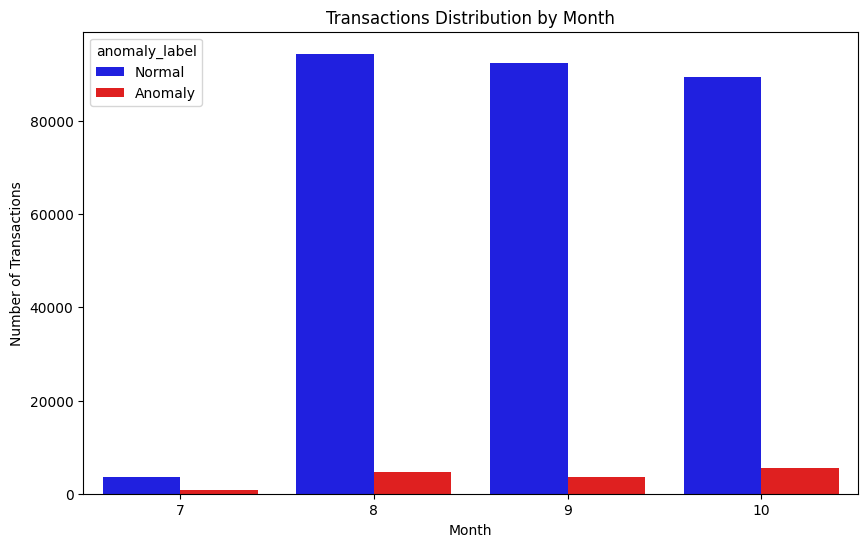
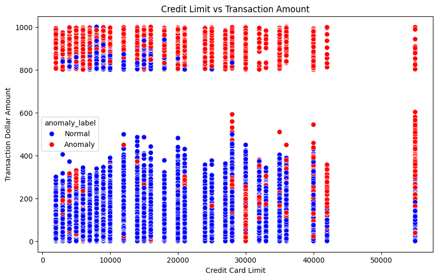

## Fraud Detection with Isolation Forest
Determine the transaction is fraud or not with anomaly detection - Isolated Forest. Dataset contain Credit Card Number, date transaction, transaction ($), Longitude and latitude position transaction, Zipcode, State, and credit card limit.

dataset source :
https://www.kaggle.com/datasets/iabhishekofficial/creditcard-fraud-detection/data

Read Dataset
```python
df_fraud
```

# Check null value
```python
df_fraud.isnull().sum()
```
credit_card                  0
date                         0
transaction_dollar_amount    0
Long                         0
Lat                          0
city                         0
state                        0
zipcode                      0
credit_card_limit            0
dtype: int64

# Check Duplicated
```python
df_fraud.duplicated().sum()
```

# Count Total CC
```python
df_fraud['credit_card'].value_counts()
```

# Count Total City
```python
df_fraud['city'].value_counts()
```

# Count Total State
```python
df_fraud['state'].value_counts()
```

# Extract date
```python
df_fraud['year'] = df_fraud['date'].dt.year
df_fraud['month'] = df_fraud['date'].dt.month
df_fraud['day'] = df_fraud['date'].dt.day
df_fraud['hour'] = df_fraud['date'].dt.hour
df_fraud.drop(['date','city', 'state', 'zipcode'], axis=1, inplace=True)
df_fraud
```

# Looking For Geographical Transaction


# Heatmap Correlation Matrix


# Preprocessing Data
```python
df_features = df_fraud.drop(columns=['credit_card'])
# Scale with standard scaler
scaler = StandardScaler()
df_scaled = scaler.fit_transform(df_features)
```

# Input into Isolation Forest
```python
iso_forest = IsolationForest(contamination=0.05, random_state=42)
iso_forest.fit(df_scaled)
anomaly_scores = iso_forest.predict(df_scaled)
df_fraud['anomaly'] = anomaly_scores
```

# Results
```python
#show only CC who haves scores -1, that random forest determined is fraud transaction
anomalies = df_fraud[df_fraud['anomaly'] == -1]
anomalies
```


# Transaction ($) Anomalies and Normal
Anomalies show a much narrower range of transaction amounts, with the majority of values falling well below those of normal transactions. There are numerous outliers, but even these outliers rarely approach the median value of normal transactions. Anomalies include a higher concentration of outliers, suggesting that while anomalous transactions are generally low in amount, a few have larger values. These outliers may indicate unusual, potentially fraudulent transactions.



Based on the geographical distribution plot and the labels from the Random Forest anomaly detection model. The Random Forest model appears to classify a large number of transactions as anomalies (red markers), indicating that it’s highly sensitive to deviations from typical geographic patterns. This can be helpful for identifying potential fraud, especially if fraudulent transactions tend to occur outside normal geographical areas. However, the high number of anomalies suggests that the model might be overestimating fraud risk, leading to potential false positives.
Normal transactions (blue markers) are primarily clustered within specific latitude and longitude bands, especially in the northern hemisphere. This concentration suggests that most legitimate transactions happen in predictable locations. Transactions outside these regions may be flagged as anomalies, possibly indicating either suspicious behavior or geographic outliers.


There are notable peaks in transaction volumes during specific hours, particularly around 0, 20, and 21 hours, with fewer transactions occurring between 3 AM and 10 AM. This pattern could reflect common daily activity cycles. While anomalies appear to occur throughout the day, they generally follow the same pattern as normal transactions, albeit in smaller volumes. However, anomalies are slightly more concentrated in the early morning hours (0–2 AM), which might suggest potential unusual activity during these times. The graph highlights a significant class imbalance, with far fewer anomalies compared to normal transactions.





Random forest is suitable here because it can handle complex patterns across multiple features, capturing temporal, monetary, and spatial information.
Given the class imbalance, techniques like class weighting, oversampling, or undersampling could improve model performance. Feature importance analysis could help determine the relative impact of each feature, allowing the model to prioritize the most relevant attributes. By leveraging these insights, the random forest model can be tuned to detect anomalies effectively, potentially improving fraud detection accuracy.


