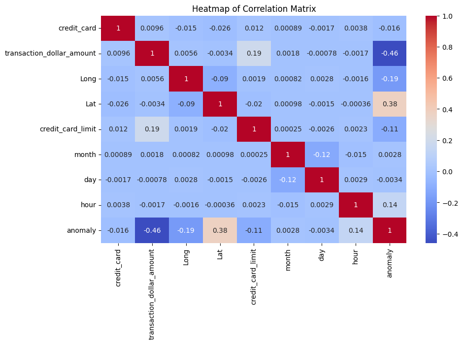

## Fraud Detection with Isolation Forest
Determine the transaction is fraud or not with anomaly detection - Isolated Forest

dataset source :
https://www.kaggle.com/datasets/iabhishekofficial/creditcard-fraud-detection/data

Read Dataset
```python
df_fraud
```
38	1003715054175576	2015-07-31 20:03:05	45.52	-80.186336	40.168399	Houston	PA	15342	20000
194	1003715054175576	2015-07-31 20:25:28	96.10	-80.156132	40.222907	Houston	PA	15342	20000
107	1003715054175576	2015-07-31 23:09:32	20.94	-80.262219	40.242532	Houston	PA	15342	20000
124	1003715054175576	2015-08-01 10:48:03	51.27	-80.176899	40.313324	Houston	PA	15342	20000
137	1003715054175576	2015-08-01 17:43:43	127.99	-80.226671	40.295995	Houston	PA	15342	20000
...	...	...	...	...	...	...	...	...	...
294582	9999757432802760	2015-10-23 20:47:23	216.30	-82.443294	32.991054	Louisville	GA	30434	6000
294503	9999757432802760	2015-10-24 01:12:54	233.97	-82.410848	32.934690	Louisville	GA	30434	6000
294508	9999757432802760	2015-10-25 21:53:33	177.51	-82.452819	32.997676	Louisville	GA	30434	6000
294519	9999757432802760	2015-10-27 21:38:09	146.37	-82.326567	32.952887	Louisville	GA	30434	6000
294514	9999757432802760	2015-10-29 21:56:30	195.25	-82.440314	33.061478	Louisville	GA	30434	6000

#Check null value
```python
df_fraud.isnull().sum()
```
credit_card                  0
date                         0
transaction_dollar_amount    0
Long                         0
Lat                          0
city                         0
state                        0
zipcode                      0
credit_card_limit            0
dtype: int64



